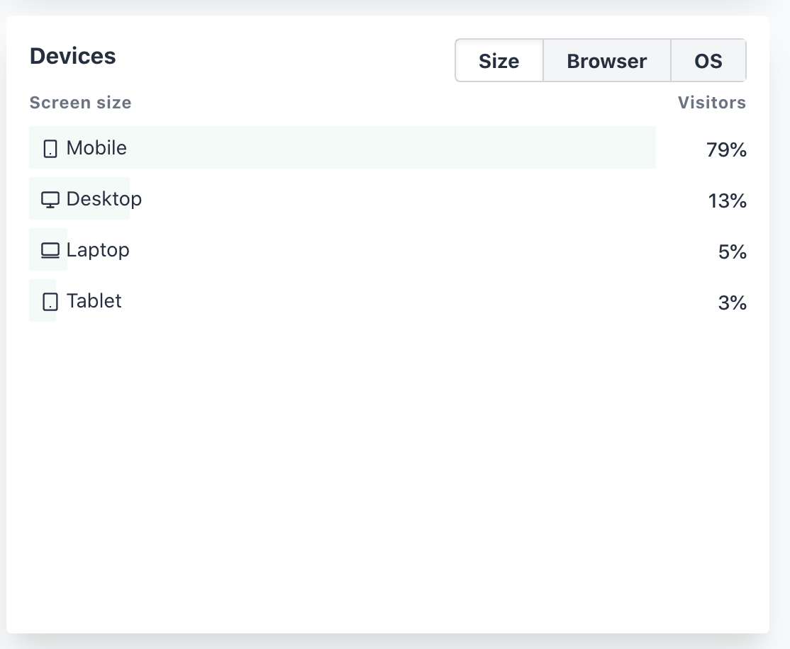

Ich wurde schon öfter mal angesprochen warum ich Google Analytics benutze. Die Antwort dafür war immer recht easy: Einfach, für mich kostenfrei, bietet was ich brauche (und noch viel mehr)  
Die anderen Optionen wären z.B. ein piwik (jetzt motomo) self hosted. Aber ehrlich gesagt hab ich keine Lust mich auch noch darum zu kümmern.  
Vor kurzem sprach ich dabei mit Menschen und jemand brachte plausible.io ins Spiel.  
Das ganze hat einige Vorteile:

- Open Source - Open Source macht vieles besser
- Simple Metrics - Google Analytics kann ehrlich gesagt zu viel
- Lightweight script - GA ist fett. Auch wenn ichs nachlade erhöht es die ladezeit
- Keine Cookies - Das ganze braucht keine tracking cookies. \o/

Offensichtlich ist das Tool besser geeignet und Datensparsamer. Dazu kommt das ganz aus der EU (Estland) und alle deren hostings sind auch in der EU. Prinzipiell also sowieso besser.

Hier ein paar Beispiele von den Metriken die ich persönlich nutze. Das Tool kann noch ein paar mehr, aber das sind die wichtigsten.

### User Count

### Top Pages

### Devices

## Kosten

Nun, im Vergleich zu google wo die Daten die Bezahlung ist kostet gute Software nunmal Geld. So auch plausible.  
Plausibles bezahlmodell geht nach Monthly Pageviews. Aktuell läuft das seit 10 Tagen und ich bin bei 110000 Views das kostet bei Yearly Payment $8 pro Monat.  
Ich hab die Menschen angeschrieben und ich bekomme als Open Source Project wohl einen Rabatt (In noch nicht ganz sicherer Höhe)  
Vermutlich werden sich die Jährlichen Kosten bei $50-\$70 einpendeln.  
Finde das ist akzeptabel.

Wo wir aber bei Kosten sind - ich würde mal transparent machen wieviel marudor.de aktuell eigentlich kostet. Ich brech das ganze auf Monatlich runter.

- Domain, 0,3875€
- Monitoring 11,66€
- plausible 5€ (70USD/year als grundlage und zum jetzigen Kurz umgerechnet)
- 4 Server 80,72€ (Das ist überdimensoniert. Die machen mehr als nur marudor.de)
- Browserstack ~~1198USD~~ 0€ (Danke Browserstack, das ist sponsored für Open Source)

Macht Gesamtkosten von knapp 100€ im Monat.  
Ich zahl das gerne - auch weil wie gesagt ein Großteil für Server drauf geht mit denen ich noch mehr mach.  
Aber falls jemand von euch etwas übrig hat freue ich mich natürlich über Spenden. Am Liebsten als monthly über github sponsor. Einfach hier schauen:  
https://github.com/marudor/

Einmalig auch gern per https://paypal.me/marudor

Aber das nur am Rande. Eigentlich gings hautpsächlich um GA und plausible.  
Und ab jetzt auf https://marudor.de ohne Google Analytics. (Auf dem Blog übrigens auch)
